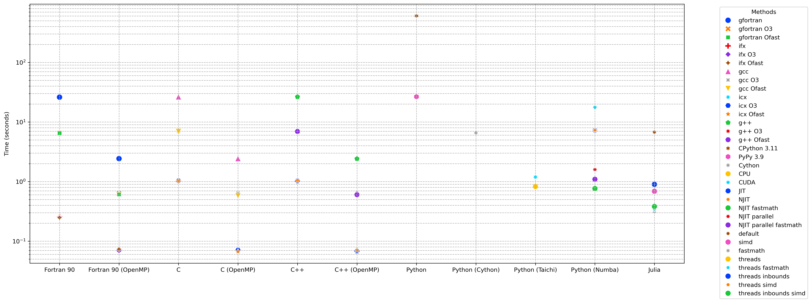

# Microbenchimark

This repository contains a collection of microbenchmarks for different programming languages. It is not a comprehensive benchmark and should not be used as a reference for performance comparison. The performance of a programming language depends on the specific use case and the implementation of the algorithm. The benchmarks are intended to give a rough idea of the performance of different programming languages and the effect of different methods to improve performance within a specific language.

Languages: Fortran90, C, C++, Python, Julia

## Nested for loops

### Windows 11 (23H2), AMD Ryzen 5 5600X, NVIDIA RTX 3060
